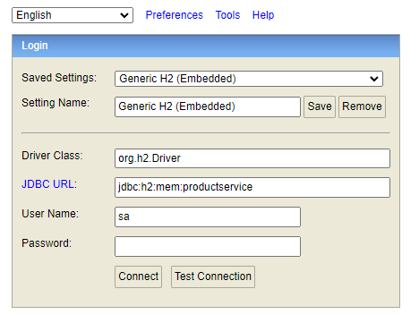
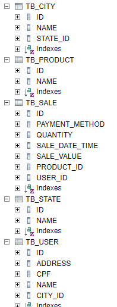

API (micro serviço) Produtos
=============

Aplicação
--

A aplicação contém os seguintes serviços disponiveis:

- Agregar o produto mais vendido na cidade do cliente
 ```
curl -X POST "http://localhost:8080/aggregate/most-sold-product" -H "accept: */*" -H "Content-Type: application/json" -d "{ \"cityId\": 1, \"cpf\": \"123412412\", \"productId\": 1, \"quantity\": 1, \"stateId\": 1, \"value\": 123}"
 ```
- Agregar um resumo do cliente, com suas 5 ultimas compras, baseado no id do usuario
 ```
 curl --location --request GET 'http://localhost:8080/aggregate/user/{userId}/summary'
 ```


Tecnologias Utilidas
--

A aplicação utiliza as seguintes tecnologias:
- Java 11
- SpringBoot2
- JPA/Hibernate
- Swagger
- Junit/Mockito
- Lombok
- H2
- Bean Validation

H2 database
--

Quando a aplicação e inicializada e feito uma carga inicial com alguns dados, contidos no arquivo data.sql

E possivel acessar o banco H2 através do link [aqui](http://localhost:8080/h2-console)

Segue as imagens abaixo de configuração e acesso:





Padrões de projetos utilizados
--
A aplicação utiliza os seguintes padrões:
- DTO Pattern (Data Transfer Object) - usado para separar os dados de entrada recebidos no controller do modelo de dados
- TDD - Test-Driven Development
- DDD - Domain Driven Design - usando uma Linguagem Ubíqua, sendo refenrenciada no modelo de dados
- SOLID - usamos alguns conceitos quanto ao princípio da responsabilidade única sendo referenciado nos conversores (Converter<SaleModel, SaleSummaryDto>) 
que tem a unica responsabilidade de transformar a camada de entrada para o modelo de dados

Swagger e documentações
--
E possivel acessar a documentação Swagger através do link [aqui](http://localhost:8080/swagger-ui.html#/)

Diretrizes
--

Segue o passo a passo de como baixar, compilar e rodar a aplicação.


Passo 01
-----

Clone o seguinte repositorio git com o seguinte comando abaixo:

```
git clone https://github.com/edubossa/product-service.git
```

Passo 02
-----

Rode o seguinte comando maven para compilar a aplicação:

```
mvn clean install
```

Passo 03
-----

Rode o seguinte comando para inicializar a aplicação:

```
java -jar target/product-service-0.0.1-SNAPSHOT.jar 
```

Passo 04
-----

Acesse o Swagger da aplicação no seguinte link [aqui](http://localhost:8080/swagger-ui.html#/)
